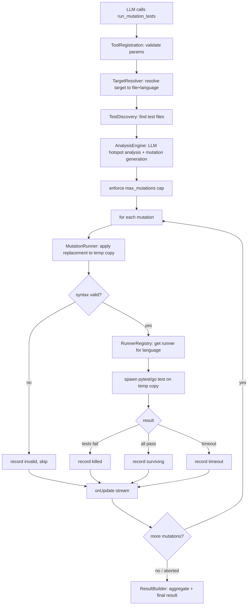

# Design: run_mutation_tests

> Requirements: @requirements.md
> Status: Approved
> Last Updated: 2026-08-12

## 1. Executive Summary

`run_mutation_tests` is implemented as a single OMP extension tool that orchestrates a four-phase pipeline inside one `execute()` call. The LLM generates mutations as full function/file body replacements (structured JSON output). The extension applies each replacement to a temp copy of the source file, spawns the native test runner via `child_process.spawn`, and streams results through `onUpdate` as each mutant completes. Cancellation, timeout, and invalid-patch handling are all first-class and produce partial results rather than errors.

Key trade-off accepted: `child_process.spawn` is used instead of `pi.exec()` because `pi.exec`'s abort/timeout semantics are undocumented in the current extension API surface. FR-009 (cancellation) is a Must Have requirement; `spawn` with manual `AbortSignal` wiring is the only verified path to satisfy it.

---

## 2. Requirements Mapping

| Requirement | Design Coverage | Notes |
|-------------|-----------------|-------|
| FR-001 Target resolution | §4 TargetResolver | File path → language from extension |
| FR-002 Target fallback | §4 TargetResolver | Symbol search → workspace grep |
| FR-003 Hotspot analysis | §4 AnalysisEngine | Structured LLM call, hotspot JSON schema |
| FR-004 Mutation generation | §4 AnalysisEngine | Hard cap enforced post-LLM, not in prompt |
| FR-005 Patch validation | §4 MutationRunner | Syntax check via temp write + language compiler/interpreter check |
| FR-006 Test execution | §4 MutationRunner | child_process.spawn per mutant |
| FR-007 Streaming progress | §4 MutationRunner | onUpdate after each mutant |
| FR-008 Final structured result | §4 ResultBuilder | Structured details + readable content text |
| FR-009 Cancellation | §4 MutationRunner | AbortSignal check per boundary; kill in-flight spawn |
| FR-010 Scope parameter | §4 ToolRegistration | zod schema, defaults, cap enforcement |
| FR-011 Language detection | §4 TargetResolver | `.py` → Python, `.go` → Go, error otherwise |
| FR-012 Original file isolation | §4 MutationRunner, TD-006 | In-place mutation with `.pi-mutation-bak` backup; restore in `finally` + SIGINT/SIGTERM handler |
| FR-013 Test file discovery | §4 TestDiscovery | Python/Go conventions per language |
| FR-014 Subprocess timeout | §4 MutationRunner | Per-mutation timeout, default 60 s |
| FR-015 Mutation description | §4 AnalysisEngine | Required field in hotspot/mutation schema |
| FR-016 Run budget warning | §4 ToolRegistration | Warn in onUpdate if max_mutations exceeds default cap |
| NFR-001 Usability | §4 ResultBuilder, §7 UX | Plain-language progress; actionable error messages |
| NFR-002 Performance | §4 MutationRunner | Scoped test runs (target test files only, not full suite) |
| NFR-003 Security / Privacy | §6 Security | In-place write with backup restore; path sanitization; no source leakage in content |
| NFR-004 Reliability | §4 MutationRunner | Skip-and-continue on any single-mutant failure |
| NFR-005 Extensibility | §4 RunnerRegistry | Language entry + runner interface only; no changes elsewhere |

---

## 3. System Architecture

### Component Overview

| Component | Responsibility | Boundaries | Notes |
|-----------|----------------|------------|-------|
| `ToolRegistration` | Register `run_mutation_tests` with zod schema; enforce `max_mutations` cap | Entry point only; no business logic | `src/index.ts` |
| `TargetResolver` | Resolve `target` string → absolute file path + language + optional symbol | Pure; no side effects | `src/target-resolver.ts` |
| `TestDiscovery` | Find relevant test file(s) for a resolved target | Filesystem read only | `src/test-discovery.ts` |
| `AnalysisEngine` | Call LLM to identify hotspots + generate mutation replacements | LLM call via OMP model context | `src/analysis-engine.ts` |
| `MutationRunner` | Apply replacements in-place (after backing up original); spawn test runner per mutant; restore original in `finally`; handle signal/timeout | Writes to target file path and `<file>.pi-mutation-bak`; spawns subprocesses | `src/mutation-runner.ts` |
| `RunnerRegistry` | Map language → `TestRunner` implementation | Interface registry; add languages without touching other components | `src/runners/index.ts` |
| `PythonRunner` | Spawn `pytest` against target test files | Implements `TestRunner` | `src/runners/python.ts` |
| `GoRunner` | Spawn `go test` against target package | Implements `TestRunner` | `src/runners/go.ts` |
| `ResultBuilder` | Aggregate per-mutant results into final structured result + readable text | Pure function | `src/result-builder.ts` |

### Data / Control Flow



---

## 4. Implementation Design

### Component / Module Structure

```text
src/
  index.ts                  # Extension factory; registers tool; no logic
  target-resolver.ts        # Target string → file path + language + symbol
  test-discovery.ts         # Find test files for a target file
  analysis-engine.ts        # LLM hotspot analysis + mutation generation
  mutation-runner.ts        # In-place backup/mutate/restore lifecycle, subprocess spawn, signal/timeout
  result-builder.ts         # Aggregate mutant results → final tool result
  runners/
    index.ts                # RunnerRegistry: language → TestRunner
    python.ts               # PythonRunner: pytest subprocess
    go.ts                   # GoRunner: go test subprocess
  types.ts                  # Shared interfaces
```

### Core Interfaces

```ts
// types.ts

/** What the LLM returns for each hotspot */
interface Mutation {
  id: string;                    // e.g. "m001"
  description: string;           // one-sentence natural language
  hotspot: string;               // what code location this targets
  replacement: string;           // full mutated function/file body
  explanation: string;           // why this mutation is likely to survive without tests
}

/** Per-mutant outcome after execution */
interface MutantResult {
  mutation: Mutation;
  outcome: "killed" | "surviving" | "invalid" | "timeout";
  testOutput?: string;           // stderr/stdout excerpt on kill; undefined otherwise
}

/** Final structured result (details field) */
interface MutationRunResult {
  cancelled: boolean;
  target: string;
  language: "python" | "go";
  scope: "function" | "file";
  total: number;
  killed: number;
  surviving: number;
  invalid: number;
  timeout: number;
  score: number | null;          // killed / (killed + surviving) * 100; null if 0 tested
  mutants: MutantResult[];
  suggestions: string[];         // one per surviving mutant
}

/** Pluggable runner interface */
interface TestRunner {
  language: string;
  /** Returns killed=true if any test fails */
  runTests(opts: {
    sourceFile: string;         // absolute path to mutated temp file
    testFiles: string[];        // absolute paths to test files
    cwd: string;
    timeoutMs: number;
    signal: AbortSignal;
  }): Promise<{ killed: boolean; output: string }>;
}

/** Runner registry entry */
interface RunnerEntry {
  language: string;
  extensions: string[];         // e.g. [".py"]
  runner: TestRunner;
}
```

### Data Model / State

No persistent state. All state is local to one `execute()` invocation:

| State | Owner | Lifetime |
|-------|-------|----------|
| Resolved target + language | `TargetResolver` return value | Single call |
| Test file paths | `TestDiscovery` return value | Single call |
| Mutation list | `AnalysisEngine` return value | Single call |
| Per-mutant results | Accumulator in `MutationRunner` | Single call |
| Backup file path (`<file>.pi-mutation-bak`) | `MutationRunner` | Single call; deleted after restore in `finally` |

**Backup lifecycle (per `execute()` call):**

1. Before the first mutation: `fs.copyFile(sourcePath, sourcePath + ".pi-mutation-bak")`.
2. For each mutant: write `mutation.replacement` to `sourcePath` → spawn test runner → after result, restore from backup with `fs.copyFile(bakPath, sourcePath)`.
3. After all mutants (or abort/error): restore from backup, then `fs.rm(bakPath)`.
4. A `process.on("SIGINT" | "SIGTERM")` handler is registered for the duration of the call; on signal, restores from backup before re-raising.
5. `SIGKILL` (`kill -9`) cannot be caught — if the OMP process is killed that way, the original file is left mutated and the `.pi-mutation-bak` file is present for manual recovery. The backup file name is intentionally greppable for this case.

### API / Integration Contract

**Tool registration:**

```ts
pi.registerTool({
  name: "run_mutation_tests",
  label: "Run Mutation Tests",
  description: `Run LLM-guided mutation tests against a Python or Go function or file.
Generates targeted mutations at identified hotspots, runs the native test suite
for each, and returns a structured mutation score with improvement suggestions.
Note: LLM-guided mutation testing is not exhaustive — it targets high-signal
locations only. Pair with line coverage tools for complete verification.`,
  parameters: z.object({
    target: z.string().describe(
      "File path (e.g. 'src/utils.py') or function/symbol name (e.g. 'calculate_total'). " +
      "Language is auto-detected from the file extension."
    ),
    scope: z.enum(["function", "file"]).optional().describe(
      "'function' (default): analyze the named function only. " +
      "'file': analyze all functions in the file."
    ),
    max_mutations: z.number().int().positive().optional().describe(
      "Maximum mutations to run. Defaults: 10 for function scope, 20 for file scope."
    ),
    timeout_ms: z.number().int().positive().optional().describe(
      "Per-mutation subprocess timeout in milliseconds. Default: 60000."
    ),
  }),
  async execute(_id, params, signal, onUpdate, ctx) { /* §4 below */ },
});
```

**Tool result `content` (human-readable):**

```text
Mutation testing complete — 8/10 mutants tested
Target: src/utils.py#calculate_total (python, function scope)
Score: 75% (6 killed / 2 surviving / 1 invalid / 1 timeout)

Surviving mutants:
  1. [m003] Removed null check on 'items' — tests don't cover empty list input
     → Suggested test: test_calculate_total_empty_items()

Cancelled: no
```

**Tool result `details` (structured for LLM):** `MutationRunResult` interface above.

---

## 5. Integration Points

| System | Purpose | Auth / Permissions | Failure Handling |
|--------|---------|--------------------|------------------|
| LLM session model | Hotspot analysis + mutation generation | Session model must be active | On LLM error: return error result; no mutations run |
| `pytest` subprocess | Python test execution | `pytest` on `$PATH` | Not found → error result naming the requirement; timeout → record `timeout`; non-zero exit → `killed` |
| `go test` subprocess | Go test execution | `go` on `$PATH` | Same as pytest |
| Filesystem | Backup write, in-place mutation write, restore | Write access to target file's directory | Backup write failure → error result before any mutation; restore failure → logged + surfaced in result |

---

## 6. Security / Permissions / Privacy

- **Original file restore guarantee:** Mutations are written to the original file path after backing up to `<file>.pi-mutation-bak`. Restore happens in a `finally` block covering abort, timeout, and error paths. A `SIGINT`/`SIGTERM` handler restores the backup before the process exits. `SIGKILL` leaves the mutated file and the `.pi-mutation-bak` backup in place for manual recovery — the backup filename is greppable (`*.pi-mutation-bak`).
- **Concurrent runs:** Only one `run_mutation_tests` call may be active per file at a time. A second call on the same file returns an error: `A mutation run is already in progress for <file>.` Enforced via a module-level `Set<string>` of in-progress absolute paths in `MutationRunner`.
- **Path sanitization:** The `target` parameter is resolved to an absolute path via `path.resolve(ctx.cwd, target)`. Any result that escapes `ctx.cwd` (i.e. starts with `..` after resolution) is rejected with an error before any filesystem access.
- **Subprocess input:** Only resolved, validated absolute paths are passed to subprocess argv. No shell interpolation is used — arguments are passed as an argv array, never a shell string.
- **Content exposure:** Tool result `content` includes mutant descriptions and outcome labels, not raw source code. `details` includes the mutation `replacement` string (needed for LLM reasoning) but not the full original file contents.

---

## 7. UX / Accessibility

- Progress lines are plain English: `✓ mutant 3/8 — "removed null check" — killed by pytest`.
- `✗` for surviving, `~` for invalid, `⏱` for timeout. Surviving mutants appear first in the final result (highest signal).
- Error results always name the target and suggest a fix: `No test files found for "src/utils.py". Looked for: tests/test_utils.py, src/test_utils.py, src/utils_test.py`.
- Cancellation produces a valid result with `cancelled: true`, not an error.

---

## 8. Edge Cases

| Case | Expected Behavior |
|------|-------------------|
| Target path does not exist | Error result: `File not found: <resolved path>. Check the target path.` |
| Target symbol not found in workspace | Error result: `No function named "<symbol>" found in .py or .go files under <cwd>.` |
| Unsupported file extension | Error result: `Unsupported language for "<file>". Supported: .py (Python), .go (Go).` |
| No test files found | Error result listing the exact paths searched |
| `pytest` / `go` not on PATH | Error result: `<binary> not found on $PATH. Install <tool> to run mutation tests on <language> targets.` |
| LLM returns invalid JSON for mutations | Error result: `Failed to parse mutation plan from LLM response. Try a narrower scope.` |
| LLM returns zero hotspots | Valid result: `0 mutations, score: null, no test gaps identified` |
| All mutations are invalid | Valid result: all `invalid`, score `null`, no tests run |
| Mutation causes syntax error in temp file | Recorded as `invalid`; run continues |
| Mutation causes infinite loop in tests | `timeout` after `timeout_ms`; subprocess killed; run continues |
| Abort before any mutation runs | `cancelled: true`, all counts 0, empty mutant list |
| Abort mid-subprocess | Current subprocess killed; file restored from backup; all prior results returned; `cancelled: true` |
| `max_mutations` exceeds LLM output | Extension caps to `max_mutations`; extras silently dropped (not run) |
| Very large file with `scope: "file"` | `max_mutations` default 20 applies; caller can raise it explicitly |
| Process killed with `SIGKILL` mid-run | Original file left mutated; `.pi-mutation-bak` backup present in same directory for manual recovery |
| Second concurrent run on same file | Error result: `A mutation run is already in progress for <file>.` |

---

## 9. Impact Analysis

| Component | Impact Type | Description and Risk | Required Action |
|-----------|-------------|----------------------|-----------------|
| `src/index.ts` | new | Extension entry point; registers tool | Create |
| `src/target-resolver.ts` | new | File/symbol resolution logic | Create |
| `src/test-discovery.ts` | new | Test file discovery heuristics | Create |
| `src/analysis-engine.ts` | new | LLM prompt construction + JSON parse | Create |
| `src/mutation-runner.ts` | new | Temp file + subprocess lifecycle | Create |
| `src/runners/index.ts` | new | RunnerRegistry | Create |
| `src/runners/python.ts` | new | PythonRunner | Create |
| `src/runners/go.ts` | new | GoRunner | Create |
| `src/result-builder.ts` | new | Result aggregation | Create |
| `src/types.ts` | new | Shared interfaces | Create |
| `package.json` | new | OMP plugin manifest | Create |
| `tsconfig.json` | new | TypeScript strict config | Create |

No existing files are modified. This is a green-field plugin.

---

## 10. Development Sequencing

1. **`package.json` + `tsconfig.json`** — no dependencies; scaffold only
2. **`src/types.ts`** — shared interfaces; no dependencies
3. **`src/target-resolver.ts`** — pure functions; testable in isolation
4. **`src/test-discovery.ts`** — pure filesystem functions; testable in isolation
5. **`src/runners/python.ts` + `src/runners/go.ts`** — subprocess wrappers; depend on `types.ts`
6. **`src/runners/index.ts`** — registry; depends on runners
7. **`src/analysis-engine.ts`** — LLM call; depends on `types.ts`
8. **`src/result-builder.ts`** — pure function; depends on `types.ts`
9. **`src/mutation-runner.ts`** — orchestration; depends on all above
10. **`src/index.ts`** — registration; depends on `mutation-runner.ts`

---

## 11. Testing / Verification Strategy

### Unit / Component

- `target-resolver`: path vs symbol resolution, language detection, path escape rejection
- `test-discovery`: Python naming conventions (`test_<name>.py`, `<name>_test.py`, `tests/` sibling), Go convention (`<name>_test.go`)
- `result-builder`: score calculation (killed/tested), null score when 0 tested, cancelled flag, surviving-first ordering
- `analysis-engine`: mutation cap enforcement (post-LLM slice), JSON parse failure path

### Integration

- `mutation-runner` with a real temp Python file + `pytest`: killed, surviving, invalid (bad syntax), timeout (slow test), abort mid-run
- `mutation-runner` with a real temp Go file + `go test`: same coverage

Integration tests gated on `RUN_INTEGRATION_TESTS=1` env var; skipped in CI without the binary.

### E2E / Manual

- Full `run_mutation_tests` call against a known Python function with an intentionally weak test suite; verify surviving mutants are reported with explanations
- Abort mid-run via Ctrl+C equivalent; verify partial results and `cancelled: true`

### Project Verification

- Lint: `tsc --noEmit`
- Test: TBD (package manager not yet decided)
- Build: TBD

---

## 12. Observability / Operations

- **Logs:** `pi.logger.debug` for resolved paths, discovered test files, mutation count, per-mutant outcome, and subprocess exit codes. No sensitive content in logs.
- **onUpdate stream:** Primary user-facing observability; one event per mutant.
- **No metrics or analytics** — single-session tool, no telemetry.

---

## 13. Migration / Rollout

- Not applicable — green-field plugin, first release.

---

## 14. Technical Decisions

### TD-001: Full-body replacement over diff/splice

- **Decision:** LLM returns the complete mutated function/file body as a string. Extension writes it to the temp copy directly.
- **Why:** Eliminates diff-parsing complexity and failure modes. LLM-generated diffs are brittle (line drift, context mismatch). Full replacement is deterministic and simple.
- **Trade-off:** Larger LLM output per mutation (full body vs delta). Acceptable at 3–10 mutations.
- **Alternatives considered:** Unified diff + `patch` subprocess (fragile); structured line-range splice (brittle if LLM miscounts lines).

### TD-002: `child_process.spawn` over `pi.exec()`

- **Decision:** Use Node.js `child_process.spawn` for test runner subprocesses.
- **Why:** FR-009 (cancellation) is Must Have. `pi.exec`'s abort/timeout semantics are undocumented. `spawn` with manual `AbortSignal` wiring is the only verified path to kill in-flight subprocesses on abort.
- **Trade-off:** More boilerplate; must manage stdout/stderr capture and timeout manually.
- **Alternatives considered:** `pi.exec()` (undocumented signal support); `ctx.invokeTool("bash")` (only available when shadowing a built-in — not applicable to net-new tools).

### TD-003: Sequential mutation execution

- **Decision:** Run mutations one at a time in sequence.
- **Why:** Parallel test runs against the same module can interfere (shared state, port conflicts, pytest-xdist complexity). Sequential execution is predictable and matches the streaming UX model.
- **Trade-off:** Wall time is `n_mutations × avg_test_time`. Mitigated by scoped test file selection (FR-006 runs only relevant test files) and per-mutation timeout.
- **Alternatives considered:** Parallel with isolated temp dirs per mutant (complexity, resource usage); batch all mutations into one test run (loses per-mutant attribution).

### TD-004: LLM mutation generation via structured output

- **Decision:** The LLM is prompted to return a JSON array of `Mutation` objects. The extension parses this and enforces the `max_mutations` cap by slicing.
- **Why:** Structured JSON is more reliable than free-text parsing. Extension-side cap enforcement is deterministic regardless of LLM compliance with the prompt.
- **Trade-off:** LLM may return malformed JSON; handled as a named error result, not a crash.
- **Alternatives considered:** XML tags (harder to parse); free text with delimiters (unreliable).

### TD-005: Syntax validation via language-native parse check

- **Decision:** For Python: `python3 -c "import ast; ast.parse(open('<temp>').read())"`. For Go: `gofmt -e <temp> > /dev/null` (gofmt fails on syntax errors).
- **Why:** Uses the language's own parser — most accurate validity check available without a full compile.
- **Trade-off:** Requires `python3` and `gofmt` on PATH (already required for pytest/go test respectively).
- **Alternatives considered:** Tree-sitter (extra dependency); regex heuristics (unreliable).

### TD-006: In-place mutation with `.pi-mutation-bak` backup

- **Decision:** Mutations are written to the original file path after backing up the original to `<file>.pi-mutation-bak`. The original is restored in a `finally` block after each mutant and at run end. `SIGINT`/`SIGTERM` handlers restore the backup before process exit.
- **Why:** Test runners must import the mutated module at its original path. Python's import system and Go's package resolution both require the file to be at its canonical location. Reconstructing a temp package structure (with `go.mod`, `PYTHONPATH` tricks) is fragile and breaks for non-trivial projects.
- **Trade-off:** A hard `SIGKILL` on the OMP process leaves the original file mutated and the `.pi-mutation-bak` file in place. Mitigated by the greppable backup filename; user restores manually with `mv file.py.pi-mutation-bak file.py`.
- **Alternatives considered:** Isolated temp dir + `PYTHONPATH`/`go.mod` copy (rejected — fragile for Go module resolution and multi-file Python packages).

---

## 15. Known Risks

| Risk | Likelihood | Impact | Mitigation |
|------|------------|--------|------------|
| LLM returns malformed JSON for mutations | Medium | Run fails with error result; no mutations executed | Clear error message suggests retry with narrower scope; JSON schema in prompt reduces frequency |
| LLM generates equivalent mutants (no behavior change) | Medium | Mutant recorded as `surviving` incorrectly | Hotspot prompt biases toward behavior-changing locations; equivalent mutants are a known LLM limitation — documented in tool description |
| Test subprocess leaves orphaned processes on timeout | Low | Resource leak | `spawn` child is killed with `SIGKILL` on timeout; `unref` not used so process exits with parent |
| Large test suite makes even scoped runs slow | Medium | User aborts; partial results still useful | Per-mutation timeout; function-scope default; streaming progress |
| `python3` vs `python` binary name varies by environment | Medium | Syntax check fails on systems with only `python` | Try `python3` first; fall back to `python` on ENOENT |
| SIGKILL on OMP process leaves mutated file | Low | Original file mutated; backup present for manual recovery | Backup filename is greppable (`*.pi-mutation-bak`); documented in tool description |

---

## 16. Implementation FAQ

**Q:** What if the LLM returns more mutations than `max_mutations`?  
**A:** The extension slices the array to `max_mutations` before executing any. The excess is dropped silently. The cap is enforced in `AnalysisEngine` immediately after parsing, before `MutationRunner` sees the list.

**Q:** How does `MutationRunner` know which test files to run for a given mutant?  
**A:** It doesn't rediscover tests per mutant. `TestDiscovery` runs once before the mutation loop and returns the test file list. All mutants for the same target share the same test file list.

**Q:** What happens if the abort signal fires while the LLM is generating mutations (before any subprocess runs)?  
**A:** The `signal.aborted` check happens before each mutant's subprocess spawn. If the signal fires during `AnalysisEngine`, the mutation loop starts with `signal.aborted === true`, skips all mutants, and returns `cancelled: true` with zero counts.

**Q:** Can a single mutation span multiple functions?  
**A:** No. Each `Mutation.replacement` is the full body of one function (function scope) or one file (file scope). Multi-function mutations would require multiple replacements and are out of scope for v1.

**Q:** How are surviving mutant explanations generated?  
**A:** The LLM generates the `explanation` field at mutation-generation time (part of the `Mutation` object), describing what the mutation changes and why it would survive without a specific test. The extension passes this through unchanged into the result.

**Q:** Why not use `pi.appendEntry` to persist mutation results?  
**A:** Out of scope for v1 (see requirements Non-Goals). Session-scoped only.

---

## 17. Open Questions

- _None._
