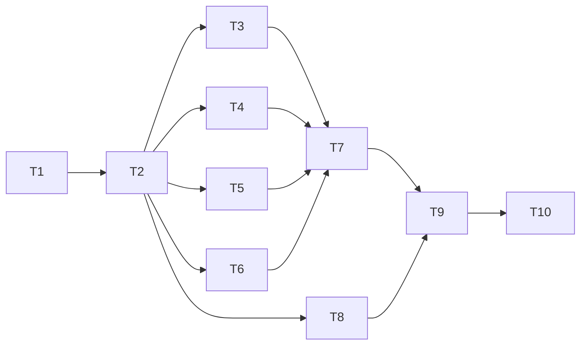

# Tasks: run_mutation_tests

> Requirements: @requirements.md
> Design: @design.md
> Status: Approved
> Last Updated: 2026-08-12

## Requirement Coverage

| Requirement | Tasks | Notes |
|-------------|-------|-------|
| FR-001 Target resolution | T3 | Path → file + language |
| FR-002 Target fallback | T3 | Symbol search in workspace |
| FR-003 Hotspot analysis | T6 | LLM prompt + JSON parse |
| FR-004 Mutation generation + cap | T6 | Post-LLM slice enforcement |
| FR-005 Patch validation | T7 | Syntax check before subprocess |
| FR-006 Test execution | T5, T7 | Runner spawn per mutant |
| FR-007 Streaming progress | T7 | onUpdate after each mutant |
| FR-008 Final structured result | T8 | ResultBuilder aggregation |
| FR-009 Cancellation | T7 | AbortSignal per boundary; kill in-flight spawn |
| FR-010 Scope parameter | T9 | zod schema, defaults, cap enforcement |
| FR-011 Language detection | T3 | `.py` → Python, `.go` → Go, error otherwise |
| FR-012 Original file isolation | T7 | In-place backup/mutate/restore lifecycle |
| FR-013 Test file discovery | T4 | Python/Go naming conventions |
| FR-014 Subprocess timeout | T7 | Per-mutation timeout, default 60 s |
| FR-015 Mutation description | T6 | Required field in Mutation schema |
| FR-016 Run budget warning | T9 | onUpdate warning if max_mutations exceeds default |
| NFR-001 Usability | T8 | Plain-language progress; actionable errors |
| NFR-002 Performance | T7 | Scoped test runs only |
| NFR-003 Security / Privacy | T3, T7 | Path sanitization; backup restore guarantee |
| NFR-004 Reliability | T7 | Skip-and-continue on any single-mutant failure |
| NFR-005 Extensibility | T5 | RunnerRegistry interface |

## Design Coverage Check

| Requirement | Design Coverage | Status | Notes |
|-------------|-----------------|--------|-------|
| FR-001–FR-002 | §4 TargetResolver | Pass | |
| FR-003–FR-004 | §4 AnalysisEngine, TD-004 | Pass | |
| FR-005–FR-007, FR-009, FR-012, FR-014 | §4 MutationRunner, TD-002, TD-003, TD-006 | Pass | |
| FR-008 | §4 ResultBuilder | Pass | |
| FR-010, FR-016 | §4 ToolRegistration | Pass | |
| FR-011 | §4 TargetResolver | Pass | |
| FR-013 | §4 TestDiscovery | Pass | |
| FR-015 | §4 AnalysisEngine | Pass | |
| NFR-001–NFR-005 | §4, §6, §7 | Pass | |

## Implementation Readiness Check

| Check | Status | Notes |
|-------|--------|-------|
| Must Have requirements have tasks | Pass | FR-001 through FR-012 all mapped |
| Tasks map to requirements, NFRs, design decisions, or enabling work | Pass | T1–T2 are enabling (scaffold); T3–T10 map to FRs/NFRs |
| Critical Questions in requirements.md are answered | Pass | None open |
| Tasks have dependencies, acceptance criteria, files, and verification | Pass | |
| Verification commands are identified or marked manual/N/A | Pass | `tsc --noEmit` for typecheck; unit tests marked; integration tests env-gated |
| No blocking design or requirements gaps remain | Pass | |

## Task Summary

| Task | Title | Priority | Estimate | Dependencies | Status |
|------|-------|----------|----------|--------------|--------|
| T1 | Project scaffold | P0 | 30m | none | done |
| T2 | Shared types | P0 | 30m | T1 | done |
| T3 | Target resolver | P0 | 1h | T2 | done |
| T4 | Test discovery | P0 | 1h | T2 | done |
| T5 | Test runners (Python + Go) + registry | P0 | 2h | T2 | done |
| T6 | Analysis engine (LLM prompt + parse) | P0 | 1h | T2 | done |
| T7 | Mutation runner (backup/spawn/restore/signal) | P0 | 2h | T3, T4, T5, T6 | done |
| T8 | Result builder | P0 | 30m | T2 | done |
| T9 | Tool registration (index.ts) | P0 | 30m | T7, T8 | done |
| T10 | Integration smoke tests | P1 | 1h | T9 | done |

## Dependency Diagram

---

## Task T1: Project scaffold

**Priority:** P0  
**Estimate:** 30m  
**Dependencies:** none  
**Covers:** Enabling work  
**Status:** pending

### Overview

Create the plugin package structure so all subsequent tasks have a place to write code and a typecheck command to run.

### Work

- [ ] Create `package.json` with `name: "pi-mutation"`, `omp.extensions: ["./src/index.ts"]`, and `devDependencies` for `typescript` and `@oh-my-pi/pi-coding-agent` (types only)
- [ ] Create `tsconfig.json` with `"strict": true`, `"module": "ESNext"`, `"moduleResolution": "bundler"`, `"target": "ES2022"`, `"outDir": "dist"`, include `src/`
- [ ] Create empty `src/index.ts` as a placeholder that exports a default function accepting `ExtensionAPI` and calling `pi.setLabel("pi-mutation")`
- [ ] Verify `tsc --noEmit` passes on the empty scaffold

### Acceptance Criteria

- [ ] `tsc --noEmit` exits 0
- [ ] `package.json` has `omp.extensions` pointing to `./src/index.ts`
- [ ] `src/index.ts` exports a default function with `ExtensionAPI` type

### Files

- `package.json` — create; plugin manifest
- `tsconfig.json` — create; TypeScript strict config
- `src/index.ts` — create; minimal placeholder

### Verification

- [ ] Typecheck: `npx tsc --noEmit`
- [ ] Unit tests: N/A (no logic yet)
- [ ] Integration tests: N/A

---

## Task T2: Shared types

**Priority:** P0  
**Estimate:** 30m  
**Dependencies:** T1  
**Covers:** Enabling work; all FRs depend on these types  
**Status:** pending

### Overview

Define all shared TypeScript interfaces in one module so every other component imports from a single source of truth.

### Work

- [ ] Implement `Mutation`, `MutantResult`, `MutationRunResult`, `TestRunner`, `RunnerEntry` interfaces exactly as specified in design.md §4 Core Interfaces
- [ ] Export all interfaces from `src/types.ts`
- [ ] Add JSDoc comments matching design.md field descriptions

### Acceptance Criteria

- [ ] `src/types.ts` exports all five interfaces
- [ ] `tsc --noEmit` passes
- [ ] `MutationRunResult.score` is `number | null`

### Files

- `src/types.ts` — create; shared interfaces

### Verification

- [ ] Typecheck: `npx tsc --noEmit`
- [ ] Unit tests: N/A (types only)

---

## Task T3: Target resolver

**Priority:** P0  
**Estimate:** 1h  
**Dependencies:** T2  
**Covers:** FR-001, FR-002, FR-011, NFR-003 (path sanitization)  
**Status:** pending

### Overview

Pure functions that resolve the `target` string to an absolute file path, detect the language, and reject paths that escape the workspace root. No side effects beyond filesystem reads.

### Work

- [ ] Implement `resolveTarget(target: string, cwd: string): ResolvedTarget | ResolverError`
  - If `target` contains a `/` or ends in `.py`/`.go`: treat as file path; resolve with `path.resolve(cwd, target)`
  - If resolved path escapes `cwd` (starts with `..`): return path-escape error
  - If path does not exist on disk: return file-not-found error
  - Detect language from extension: `.py` → `"python"`, `.go` → `"go"`, else unsupported-language error
  - If `target` has no path separator and no recognized extension: treat as symbol name; search `cwd` recursively for `.py`/`.go` files containing `def <symbol>(` or `func <symbol>(`; return first match with file path and symbol; return symbol-not-found error if none
- [ ] Implement `ResolvedTarget` type: `{ filePath: string; language: "python" | "go"; symbol?: string }`
- [ ] Implement `ResolverError` type: `{ kind: "not_found" | "escape" | "unsupported" | "symbol_not_found"; message: string }`
- [ ] Write unit tests for: path resolution, language detection, path escape rejection, symbol found, symbol not found, unsupported extension

### Acceptance Criteria

- [ ] `.py` file path resolves to `{ language: "python" }`
- [ ] `.go` file path resolves to `{ language: "go" }`
- [ ] `../outside.py` returns `escape` error
- [ ] Unknown symbol returns `symbol_not_found` error naming the symbol
- [ ] `.js` file returns `unsupported` error naming the extension
- [ ] All unit tests pass

### Files

- `src/target-resolver.ts` — create
- `src/__tests__/target-resolver.test.ts` — create

### Verification

- [ ] Unit tests pass: `node --test src/__tests__/target-resolver.test.ts`
- [ ] Typecheck: `npx tsc --noEmit`

---

## Task T4: Test discovery

**Priority:** P0  
**Estimate:** 1h  
**Dependencies:** T2  
**Covers:** FR-013, NFR-001 (error messages listing searched paths)  
**Status:** pending

### Overview

Pure filesystem functions that find the relevant test file(s) for a resolved target, per language convention. Returns the list of paths searched on failure so error messages are actionable.

### Work

- [ ] Implement `discoverTests(target: ResolvedTarget): string[] | DiscoveryError`
- [ ] Python: look for `test_<basename>.py` and `<basename>_test.py` in the same directory; also `tests/test_<basename>.py` as a sibling of the source file's directory
- [ ] Go: look for `<basename>_test.go` in the same directory (same package)
- [ ] Return `DiscoveryError` with `searchedPaths: string[]` when nothing is found
- [ ] Write unit tests for each naming convention, tests/ sibling case, and not-found case

### Acceptance Criteria

- [ ] Python: finds `test_utils.py` next to `utils.py`
- [ ] Python: finds `tests/test_utils.py` one level up from `src/utils.py`
- [ ] Go: finds `utils_test.go` next to `utils.go`
- [ ] Not found returns error with full list of searched paths
- [ ] All unit tests pass

### Files

- `src/test-discovery.ts` — create
- `src/__tests__/test-discovery.test.ts` — create

### Verification

- [ ] Unit tests pass: `node --test src/__tests__/test-discovery.test.ts`
- [ ] Typecheck: `npx tsc --noEmit`

---

## Task T5: Test runners + registry

**Priority:** P0  
**Estimate:** 2h  
**Dependencies:** T2  
**Covers:** FR-006, FR-014, NFR-004 (subprocess cleanup), NFR-005  
**Status:** pending

### Overview

Implement `TestRunner` for Python and Go, plus the `RunnerRegistry` that maps language strings to runner instances. Runners spawn subprocesses with argv arrays (no shell), respect `AbortSignal`, enforce timeout, and kill the child on abort or timeout.

### Work

- [ ] Implement `PythonRunner` in `src/runners/python.ts`
  - `runTests` spawns `pytest <testFiles...> --tb=short -q` with `cwd` set to the source file's directory
  - Non-zero exit → `{ killed: true, output }`; zero exit → `{ killed: false, output }`
  - Timeout: kill child with `SIGKILL` after `timeoutMs`; return `{ killed: false, output: "timeout" }` — caller maps to `timeout` outcome
  - Abort signal: kill child with `SIGKILL`; rethrow `AbortError`
  - Binary not found (`ENOENT`): throw named error `PythonNotFoundError`
- [ ] Implement `GoRunner` in `src/runners/go.ts`
  - `runTests` spawns `go test ./...` with `cwd` set to the source file's directory
  - Same killed/timeout/abort semantics as PythonRunner
  - Binary not found: throw `GoNotFoundError`
- [ ] Implement `RunnerRegistry` in `src/runners/index.ts`
  - `registerRunner(entry: RunnerEntry)` and `getRunner(language: string): TestRunner | undefined`
  - Pre-register Python and Go runners
- [ ] Write unit tests using a mock child process (no real pytest/go required) for: killed on non-zero exit, surviving on zero exit, timeout kills child, abort kills child

### Acceptance Criteria

- [ ] `RunnerRegistry.getRunner("python")` returns `PythonRunner`
- [ ] `RunnerRegistry.getRunner("go")` returns `GoRunner`
- [ ] `RunnerRegistry.getRunner("rust")` returns `undefined`
- [ ] Timeout fires and child process is killed
- [ ] Abort signal kills in-flight child process
- [ ] All unit tests pass without pytest or go installed

### Files

- `src/runners/python.ts` — create
- `src/runners/go.ts` — create
- `src/runners/index.ts` — create
- `src/__tests__/runners.test.ts` — create

### Verification

- [ ] Unit tests pass: `node --test src/__tests__/runners.test.ts`
- [ ] Typecheck: `npx tsc --noEmit`

---

## Task T6: Analysis engine

**Priority:** P0  
**Estimate:** 1h  
**Dependencies:** T2  
**Covers:** FR-003, FR-004, FR-015  
**Status:** pending

### Overview

Builds the LLM prompt, calls the session model, parses the structured JSON mutation list, and enforces the `max_mutations` cap by slicing. No subprocess or filesystem work.

### Work

- [ ] Implement `analyzeAndGenerate(opts: { sourceCode: string; testCode: string; target: string; scope: string; maxMutations: number; language: string }): Promise<Mutation[] | AnalysisError>`
- [ ] Build the prompt: instruct the LLM to act as a mutation testing expert, identify hotspots, return a JSON array matching the `Mutation` schema, one-sentence `description` and `explanation` fields required, `replacement` is the full mutated body
- [ ] Parse the LLM response as JSON; on parse failure return `AnalysisError` with kind `"parse_error"`
- [ ] Validate each parsed item has required fields (`id`, `description`, `replacement`, `explanation`); drop invalid items
- [ ] Slice result to `maxMutations` before returning — cap enforced here, not in the prompt
- [ ] Write unit tests: valid JSON parsed correctly, malformed JSON returns `parse_error`, cap enforced when LLM returns more than `maxMutations`, zero mutations returns empty array

### Acceptance Criteria

- [ ] Valid JSON response returns `Mutation[]`
- [ ] Malformed JSON returns `AnalysisError` with `kind: "parse_error"`
- [ ] LLM returning 15 mutations with `maxMutations: 10` returns exactly 10
- [ ] LLM returning 0 mutations returns `[]` (not an error)
- [ ] All unit tests pass

### Files

- `src/analysis-engine.ts` — create
- `src/__tests__/analysis-engine.test.ts` — create

### Verification

- [ ] Unit tests pass: `node --test src/__tests__/analysis-engine.test.ts`
- [ ] Typecheck: `npx tsc --noEmit`

---

## Task T7: Mutation runner

**Priority:** P0  
**Estimate:** 2h  
**Dependencies:** T3, T4, T5, T6  
**Covers:** FR-005, FR-006, FR-007, FR-009, FR-012, FR-014, NFR-002, NFR-003, NFR-004  
**Status:** pending

### Overview

The orchestration core. Manages the full backup → mutate → spawn → restore loop for each mutation, streams progress via `onUpdate`, handles cancellation and timeout per mutation, and guarantees the original file is restored in all exit paths.

### Work

- [ ] Implement `runMutations(opts: RunMutationsOpts): Promise<MutantResult[]>`
- [ ] Backup: `fs.copyFile(sourcePath, sourcePath + ".pi-mutation-bak")` before the first mutation; error result if backup write fails
- [ ] Concurrent-run guard: module-level `Set<string>` of in-progress absolute paths; return error if already in set
- [ ] Per mutation:
  - Check `signal.aborted` before starting; if true, break loop
  - Write `mutation.replacement` to `sourcePath`
  - Syntax check: Python via `python3 -c "import ast; ast.parse(...)"` (fallback `python` on ENOENT); Go via `gofmt -e <file> > /dev/null`
  - If syntax check fails: record `invalid`, restore original, continue
  - Spawn runner via `RunnerRegistry`; on timeout record `timeout`; on abort kill child and break
  - Record `killed` or `surviving` from runner result
  - Restore original from backup after each mutation
  - Emit `onUpdate` with plain-language progress line
- [ ] `finally` block: restore original from backup, delete `.pi-mutation-bak`, remove path from in-progress set
- [ ] `SIGINT`/`SIGTERM` handler registered for duration of call: restores backup, removes handler, re-raises signal
- [ ] Write unit tests with mock runner and mock filesystem for: backup created, restore on success, restore on abort, invalid patch skipped, timeout recorded, concurrent run rejected, in-progress set cleaned up after run

### Acceptance Criteria

- [ ] Original file content is identical before and after a complete run
- [ ] `.pi-mutation-bak` is deleted after a successful run
- [ ] Abort mid-run: in-flight subprocess killed, partial results returned, backup restored, `.pi-mutation-bak` deleted
- [ ] Syntax-invalid mutation recorded as `invalid`; test suite not spawned for that mutant
- [ ] Second concurrent call on same file returns named error
- [ ] `onUpdate` called once per mutant with outcome and running count
- [ ] All unit tests pass

### Files

- `src/mutation-runner.ts` — create
- `src/__tests__/mutation-runner.test.ts` — create

### Verification

- [ ] Unit tests pass: `node --test src/__tests__/mutation-runner.test.ts`
- [ ] Typecheck: `npx tsc --noEmit`

---

## Task T8: Result builder

**Priority:** P0  
**Estimate:** 30m  
**Dependencies:** T2  
**Covers:** FR-008, NFR-001  
**Status:** pending

### Overview

Pure function that aggregates a `MutantResult[]` into the final `MutationRunResult` and renders the human-readable `content` string. No I/O.

### Work

- [ ] Implement `buildResult(opts: { mutants: MutantResult[]; cancelled: boolean; target: string; language: string; scope: string }): { content: string; details: MutationRunResult }`
- [ ] Score: `killed / (killed + surviving) * 100`, rounded to nearest integer; `null` when `killed + surviving === 0`
- [ ] Surviving mutants listed first in `content`, each with `description`, `explanation`, and one `→ Suggested test:` line derived from `explanation`
- [ ] `cancelled: true` reflected in both `content` (`Cancelled: yes`) and `details`
- [ ] Write unit tests: score calculation, null score, cancelled flag, surviving-first ordering, zero mutations

### Acceptance Criteria

- [ ] Score of 6 killed / 2 surviving → `75`
- [ ] 0 killed / 0 surviving → score `null`
- [ ] `cancelled: true` appears in `content` text and `details.cancelled`
- [ ] Surviving mutants appear before killed mutants in `content`
- [ ] All unit tests pass

### Files

- `src/result-builder.ts` — create
- `src/__tests__/result-builder.test.ts` — create

### Verification

- [ ] Unit tests pass: `node --test src/__tests__/result-builder.test.ts`
- [ ] Typecheck: `npx tsc --noEmit`

---

## Task T9: Tool registration

**Priority:** P0  
**Estimate:** 30m  
**Dependencies:** T7, T8  
**Covers:** FR-010, FR-016, US-001, US-002, US-004  
**Status:** pending

### Overview

Wire everything together in `src/index.ts`: register the tool with the zod schema from design.md, orchestrate the pipeline call sequence, map errors to actionable error results, and emit the budget warning when `max_mutations` exceeds the default cap.

### Work

- [ ] Replace placeholder `src/index.ts` with the full extension factory
- [ ] Register `run_mutation_tests` with zod schema exactly as specified in design.md §4 API Contract
- [ ] Pipeline: `resolveTarget` → `discoverTests` → read source + test file contents → `analyzeAndGenerate` → `runMutations` → `buildResult` → return
- [ ] Map each `ResolverError` / `DiscoveryError` / `AnalysisError` kind to an actionable error result string (per design.md §8 Edge Cases)
- [ ] Emit budget warning via `onUpdate` when `params.max_mutations` exceeds the default for the resolved scope
- [ ] `signal.aborted` check before `analyzeAndGenerate`; return `cancelled: true` result with zero counts if already aborted

### Acceptance Criteria

- [ ] Tool is registered and callable by name `run_mutation_tests`
- [ ] Each error kind produces a named, actionable error result (not a thrown exception)
- [ ] Budget warning emitted when `max_mutations` > default for scope
- [ ] Pre-aborted signal returns `cancelled: true` with zero counts without touching the filesystem
- [ ] `tsc --noEmit` passes

### Files

- `src/index.ts` — modify (replace placeholder)

### Verification

- [ ] Typecheck: `npx tsc --noEmit`
- [ ] Manual: load extension in OMP and confirm tool appears in tool list (T10 covers full smoke)

---

## Task T10: Integration smoke tests

**Priority:** P1  
**Estimate:** 1h  
**Dependencies:** T9  
**Covers:** US-001, US-003, US-004, US-005 (end-to-end); FR-005–FR-009 integration  
**Status:** pending

### Overview

End-to-end verification against real Python and Go fixtures with a mock LLM. Gated on `RUN_INTEGRATION_TESTS=1` so CI skips without the binaries. Confirms the full pipeline works against real subprocesses and the backup/restore lifecycle is correct.

### Work

- [ ] Create `fixtures/python/` with a small module and test file (e.g. `calculator.py` + `test_calculator.py`) with an intentionally weak test that would survive a boundary-condition mutation
- [ ] Create `fixtures/go/` with equivalent Go module and test
- [ ] Write integration test (Python): full `runMutations` with a mock `AnalysisEngine` returning a known mutation set; verify `killed`, `surviving`, and `invalid` outcomes against real `pytest`
- [ ] Write integration test (Go): same against real `go test`
- [ ] Write abort test: start run, fire abort after first mutant, verify partial results and original file intact
- [ ] Verify `.pi-mutation-bak` is absent after all tests complete
- [ ] Document `RUN_INTEGRATION_TESTS=1` requirement in test file header comment

### Acceptance Criteria

- [ ] Python integration test: known weak test produces at least one `surviving` mutant
- [ ] Go integration test: same
- [ ] Abort test: original file content unchanged after abort; `.pi-mutation-bak` absent
- [ ] All integration tests pass with `RUN_INTEGRATION_TESTS=1 pytest --version && go version` available
- [ ] Tests skipped cleanly (exit 0) when env var is absent

### Files

- `fixtures/python/calculator.py` — create
- `fixtures/python/test_calculator.py` — create
- `fixtures/go/calculator.go` — create
- `fixtures/go/calculator_test.go` — create
- `fixtures/go/go.mod` — create
- `src/__tests__/integration.test.ts` — create

### Verification

- [ ] Integration tests pass: `RUN_INTEGRATION_TESTS=1 node --test src/__tests__/integration.test.ts`
- [ ] Skipped cleanly: `node --test src/__tests__/integration.test.ts` (no env var)
- [ ] Typecheck: `npx tsc --noEmit`

---

## Completion Rules

- Do not mark a task complete without implementation and verification evidence.
- Tests and verification belong inside each implementation task — no separate testing task.
- If a task reveals a requirements or design gap, stop and update the relevant artifact through the proper gate.
